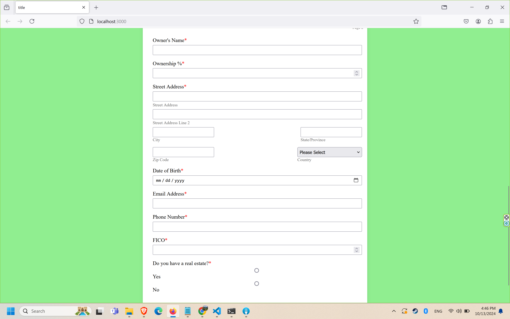

# Funding-Application-Template


This project requires Node.js and npm.  
  ```node server.js``` will boot up the app locally at port 3000.

### Run app in a container
- Docker-desktop needed and run the following commands
- ```docker build -t template```  (Build image and install all the dependencies)    
- ```docker run -p 3000:3000 template``` (Docker will map the container at port 3000 as well)

### Stack
Built with Html, CSS, Javascript, sqlite3, Express, and Docker

### Demo





